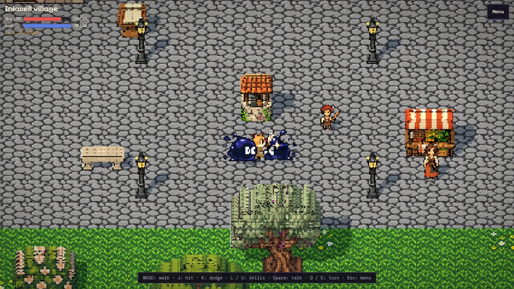
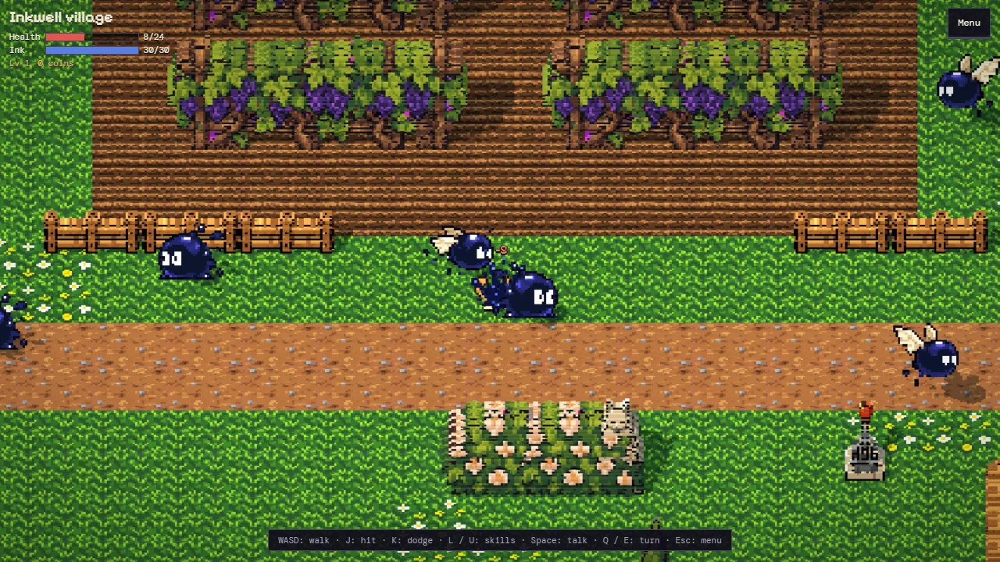
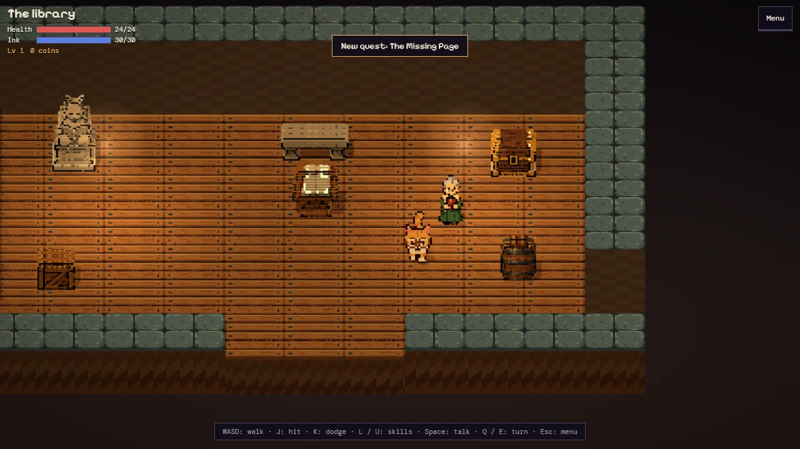
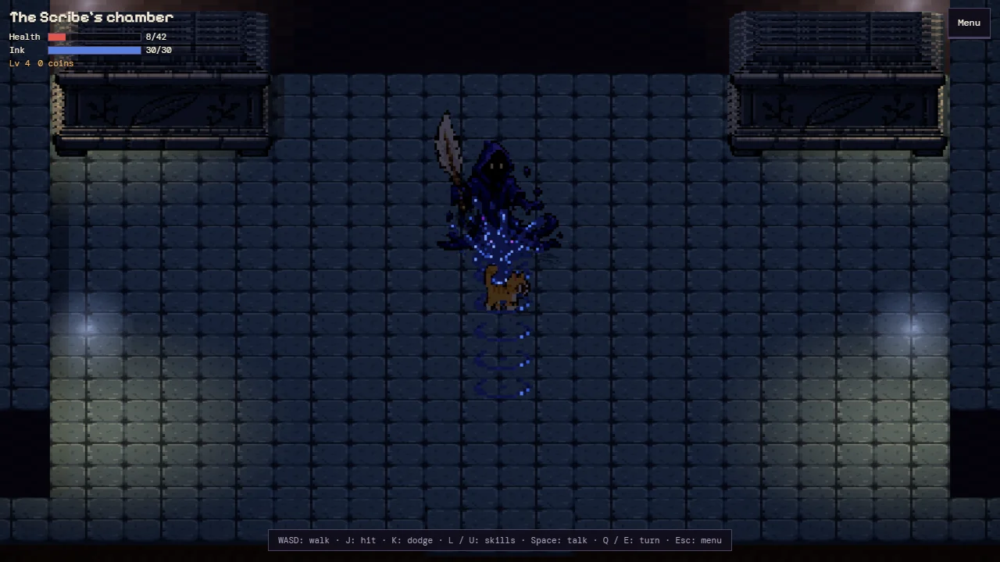

# The Scholar Cat — Chapter 1: The Missing Page

A small retro action-RPG in a 2.5D pixel diorama. After a night storm, page 7 of the library's old codex is torn
into three pieces, and where its ink drips, creatures crawl out of the blots. Folio, the library cat, takes up a
quill and goes after the pieces.

**Play it at [martindavinci.github.io/mdv-demo-rpg-cat](https://martindavinci.github.io/mdv-demo-rpg-cat/)**

In English and Italian. On a computer with a keyboard or a gamepad, and on a phone with touch controls. About
twenty minutes to the end of the chapter.

<table>
<tr>
<td width="50%"></td>
<td width="50%"></td>
</tr>
<tr>
<td width="50%"></td>
<td width="50%"></td>
</tr>
</table>

## What is in Chapter 1

- An open village ringed by cliffs: the square, the church, the road east past the vineyards to the windmill, a
  pond, a fenced garden. The library, the bakery and the crypt under the church are rooms of their own.
- A quill combo of three swings, a dodge, and two ink skills you learn on the way: **Ink dash**, which passes
  through enemies and over ink pools, and **Inkwell**, a splash that slows everything around you.
- Four kinds of inky creatures and a boss with two phases. Every attack is announced: a Blot squashes flat before
  it hops, an Inkfly stops and shivers before it dives, ink marks appear on the floor before they burst. A hit
  during the warning cancels the attack.
- Five levels, three equipment slots (quill, coat, charm), things to eat and drink, a shop, a main quest and two
  side quests, a statue that asks a riddle and a crypt with three levers.

## Controls

| | Keyboard | Gamepad | Phone |
| --- | --- | --- | --- |
| Walk | WASD or arrows | left stick | stick, bottom left |
| Hit (and talk) | J or Z | A | **Hit** — it reads **Talk** next to someone |
| Dodge | K, X or Shift | B | **Dodge** |
| Ink dash / Inkwell | L or C / U or V | X / Y | **Dash** / **Well**, once learned |
| Talk, open, read | Space or Enter | A | **Talk** |
| Turn the view | Q / E, or drag | shoulder buttons | drag the scene |
| Menu | Esc or Tab | Start | **Menu**, top right |

## Saving

The game saves itself in this browser when you change area and when a quest moves on; reading at a reading desk
saves and restores your health and ink. **Menu → Save code** shows the whole save as a code of letters and digits:
paste it into **Load code** on the title screen of any browser to carry on there. A code with a wrong or missing
letter is refused, not half-loaded.

Options (language, frame rate 30/60/120, music, effects, screen shake, shadows) are kept in the browser apart from
the save.

## Privacy

The game runs entirely in your browser. It makes no network requests after the page has loaded, has no account,
no analytics and no ads. The save and the options stay in this browser's storage; nothing is sent anywhere.

## How it is made

- The world is drawn the way [Borghi in diorama](https://martindavinci.github.io/mdv-demo-diorama/) draws its
  villages: every building, tree and prop is a flat pixel-art sprite whose pixels are given a depth, then lit and
  shadowed in WebGL with [three.js](https://threejs.org/). Characters are flat cards that always face the camera.
- The pixel art was generated with ChatGPT from written prompts, then cleaned, cut, resampled to one pixel grid and
  given depth by a small pipeline written for this game. The title picture is one of those images.
- The music and the sound effects are made in code at runtime: two pulse voices, a triangle and noise, like an old
  console.
- Everything ships as a few static files; it also runs from a downloaded copy opened as a local file.

## License

The code is under the MIT License (see [LICENSE](LICENSE)). three.js is © its authors, MIT. The fonts Pixelify
Sans and DM Mono are under the SIL Open Font License.
